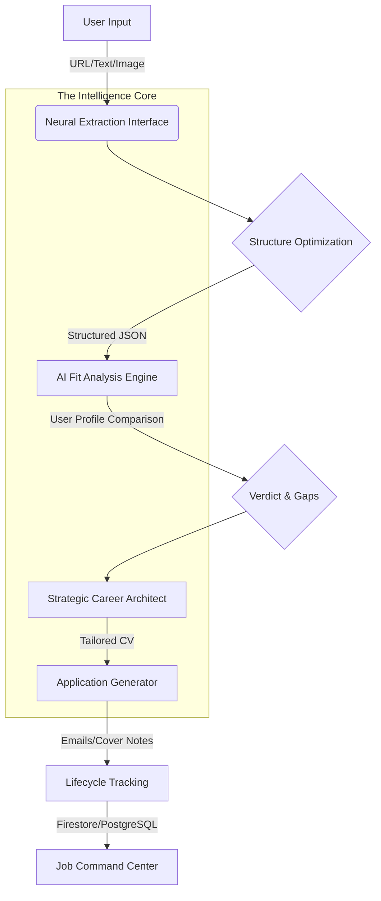

# VISION 2060: Job Capture & Apply Assistant

Vision 2060 is a specialized AI-powered platform designed to streamline the job search and application lifecycle. It uses the Gemini 3 Flash model for advanced reasoning across various document formats and integrates with both Firebase (Firestore/Auth) and a custom tracking API (PostgreSQL) for resilient data persistence.

## 🛤 The Vision 2060 Journey: From Chaos to Career

Navigating the modern job market is an exercise in friction. Vision 2060 was built to solve specific "Data Fatigue" and "Imposter Syndrome" pain points that stop high-potential candidates from reaching the interview.

### Phase 1: The Frictionless Intake
**The Pain:** You find a great job, but it's on a site with massive ads, cookie banners, and irrelevant sidebar text. Copying it manually results in a mess.
**The Solution:** Paste the URL. Vision 2060's neural scraper strips the noise, while our multi-modal processing treats an image of a job board as if it were a direct API. We turn chaos into a clean, structured schema in seconds.

### Phase 2: The Tactical "Go/No-Go"
**The Pain:** Applying to everything is a recipe for burnout. You need to know *if* you're a fit before investing hours.
**The Solution:** The system instantly cross-references your master profile against the job's hidden requirements. You get a "Verdict" (Relevant, Maybe, Skip) and a clear breakdown of your "Strengths" vs. your "Gaps." We don't just say you're a match; we explain the reasoning.

### Phase 3: The Strategic Pivot (CV Tailoring)
**The Pain:** Generic CVs get filtered by ATS. Tailoring a CV for every job is the most time-consuming part of the search.
**The Solution:** Our **Strategic Career Architect** takes over. It doesn't just rewrite your CV; it re-engineers it. It identifies the company's pain points and positions your experience as the exact solution. Every bullet is optimized using the "X-Y-Z" impact formula.

### Phase 4: Precision Communication
**The Pain:** Writing cover letters that sound "professional" yet "authentic" is exhausting.
**The Solution:** Choose your tone—Professional, Confident, or Concise. The system generates a cover note that uses verified facts from your profile. No hallucinations, no fluff—just a high-impact narrative that bridges your past to their future.

### Phase 5: The Command Center
**The Pain:** Once applied, jobs often vanish into the "Black Hole" of spreadsheets and bookmarks.
**The Solution:** Every job enters your real-time dashboard. Track status changes (Interview, Offer, Follow-up) that sync across Firestore and PostgreSQL. Set reminders for follow-ups so you're never the candidate that got ghosted because of a lost email.

## 🚀 Implemented Capabilities

### 1. Neural Extraction Interface
The platform allows users to ingest job data from multiple sources:
- **Text Extraction**: Process raw job descriptions directly from the clipboard.
- **Link Processing**: Enter a URL (LinkedIn, Indeed, etc.). The system uses a **Node.js Scraping Service** (`/api/fetch-url`) with `cheerio` to bypass site noise and extract clean, structured text before AI processing.
- **Visual Capture**: Upload images or screenshots of job listings. The system uses Gemini's multi-modal capabilities (Base64 encoding + `inlineData` parts) to parse visual data into structured fields.
- **Fields Captured**: Title, Company, Summary, Requirements, Required/Preferred Skills, Seniority, Employment Type, Location, Remote Policy, Application Method, Salary Info, and Deadline.
- **Audit Tool**: Includes a `RawDataViewer` component for users to inspect the underlying structured JSON generated by the neural link.

### 2. AI Fit Analysis Engine
Once a job is captured, the system performs a comparative analysis against the user's profile:
- **Intelligent Caching**: Analysis results are cached within the document. Fresh analysis is only re-triggered if the User Profile's `updated_at` timestamp is more recent than the job's `analysis_profile_at` record.
- **Auto-Processing**: If the user profile is sufficiently populated (>50 characters of CV text), the system automatically triggers a Fit Analysis immediately following successful job capture.
- **Verdict Mapping**: Classifies fit using the `Verdict` enum (*Relevant*, *Maybe*, *Not Worth It*).
- **Apply Recommendation**: Provides actionable advice using the `ApplyRecommendation` enum (*Apply*, *Apply if Time*, or *Skip*).
- **Relational Strengths & Gaps**: Lists specific reasons why the user is a match and highlights exactly where skills or experience Gaps exist.
- **Fit Summary**: A generated explanation of the overall alignment using high-density semantic analysis.

### 3. Application Generation & Follow-Up
Automated creation of tailored professional content:
- **Rich Text Rendering**: Uses `react-markdown` to render AI-generated content (emails, cover notes) with consistent professional formatting.
- **Output Modes**: Support for standard *Emails* and *Short-form application answers* via the `OutputMode` enum.
- **Neural Tones**: Users can choose between *Professional*, *Confident*, or *Concise* personas via the `Tone` enum.
- **Grounding Strategy**: The AI is strictly prompted to use only verified data from the `UserProfile` schema, preventing "hallucinated" experience claims.
- **Smart Follow-Up**: Automatically generates polite follow-up emails based on original application context and current date using the `generateFollowUp` logic.

### 4. Professional Profile Synthesis
Build a professional identity without manual form filling:
- **CV Extraction**: Paste CV/Resume text. The `synthesizeProfile` method extracts structured data including `target_roles`, `skills`, and `experience_summary`.
- **Preference Management**: Set default `tone_preference` and store professional social links (`linkedin_url`, `portfolio_url`).

### 5. Dual-Storage Management (Command Center)
Uses a hybrid architecture for managing job data:
- **Firestore (Real-time)**: 
    - **Reactive Listeners**: Implements `onSnapshot` listeners for `jobs`, `applications`, `chat_history`, and `system/stats`, ensuring the UI reflects database changes instantly without page refreshes.
    - **Atomic Batching**: Uses `writeBatch` for `bulkDeleteJobs` and `bulkDeleteApplications` to ensure all-or-nothing consistency during mass data management.
    - `users/{uid}`: Stores persistent user profiles with `updated_at` tracking for cache invalidation.
    - `jobs/{jobId}`: Stores high-fidelity extraction and analysis results.
    - `applications/{appId}`: Stores generated communications mapped to specific job IDs.
    - `chat_history/{id}`: Stores the AI interaction audit trail including prompts and multi-modal responses.
    - `system/stats`: Stores dynamic system metrics synchronized in real-time.
- **PostgreSQL Tracking (Relational)**:
    - Integrated via a FastAPI proxy (`/backend-v2060/tracking/jobs`).
    - **Lifecycle Synchronization**: Automatically triggers PostgreSQL status updates during Firestore `updateJobStatus` calls using the `X-Firebase-Auth` security handshake.
    - Maintains chronological lifecycle history with specific `JobStatus` transitions (*Saved, Captured, Analyzed, Applied, Interview, Rejected, Offer, Archived, Follow Up*).

### 6. AI Interaction Logs (Neural Audit)
A historical record of all system reasoning:
- **System Monitoring**: Admin-level `ai_logs` collection stores fine-grained performance metadata (model version, prompt/response body, latency in ms).
- **AI Logs (History)**: Archives every Prompt/Response pair. Supports four types: `extraction`, `analysis`, `generation`, `synthesis`.
- **Re-Run Functionality**: The `handleReRun` logic re-triggers specific AI tasks by re-populating the `captureInput` state with historical context, allowing for iterative optimization.

## 🛠 Technical Specifications

### Frontend Architecture
- **Core**: React 19 (Modern) with Vite.
- **State Management**: Reactive state using `useState` and `useEffect` hooks, coordinated with real-time Firebase listeners.
- **Styling Engine**: **Tailwind CSS v4** with a custom design system:
    - **Visual Identity**: "Glassmorphism" UI using `.glass-card` and `.neon-glow-*` utility classes.
    - **Aesthetic Accents**: Features a "Neural Ticker" marquee for simulated real-time nodes and animated background glows.
    - **Components**: Polished UI kit in `src/components/UI.tsx` including `GlassCard`, `NeonButton`, `FuturisticInput`, and `FuturisticTextarea`.
- **Animation Strategy**: Comprehensive usage of `motion` (framer-motion) for `AnimatePresence` route transitions and layout-stable entry effects.
- **Data Visualization**: `recharts` integration for tracking application trends (BarChart, AreaChart).
- **Parsing**: `react-markdown` for structured AI output display.
- **Icons**: `lucide-react` library.

### Backend Infrastructure
- **Full-Stack Bridge**: Node.js/Express server providing:
    - **Content Refinement**: Scalable web scraping proxy (`cheerio` + `fetch`) that aggressively prunes HTML noise (scripts, styles, nav, footer) to minimize token consumption.
    - **API Gateway**: Proxy (`http-proxy-middleware`) routing to the Python/FastAPI backend.
- **Python Intelligence**: FastAPI backend managing the relational PostgreSQL connection using **SQLAlchemy** and **psycopg2**.
- **OCR Engine**: Optional backend support for OCR via `pytesseract` and `Pillow` (PDI) for image-based job capture.
- **AI Integration**: Official Google Generative AI SDK (`@google/genai`) targeting `gemini-3-flash-preview`.

### Security Layer
- **Identity**: Firebase Authentication with Google OAuth provider.
- **Hardened Multi-Tenancy**: 
    - **Data Isolation**: Enforced at the database level via complex Firestore Security Rules. Every document (`jobs`, `applications`, `cv_history`, `ai_logs`) is anchored to a `uid` field.
    - **Request Validation**: Rules strictly forbid `list` operations without a `where("uid", "==", request.auth.uid)` constraint, preventing cross-user data leakage even in high-traffic environments.
    - **Audit Integrity**: User-specific `chat_history` ensures that career strategy interactions remain private and contextual to the individual user.
- **Authorization**: Custom `X-Firebase-Auth` header used for backend PostgreSQL calls to bypass proxy audience mismatches.
- **Error Propagation**: Centralized `handleFirestoreError` system mapping database exceptions to `OperationType` for high-fidelity debugging (`create`, `update`, `delete`, `list`, `get`, `write`).
- **Rules**: Production-ready `firestore.rules` enforcing UID-based ownership and schema validation for the `chat_history` and `applications` collections.

---
*Vision 2060 - Protocol version 2.0.60*
